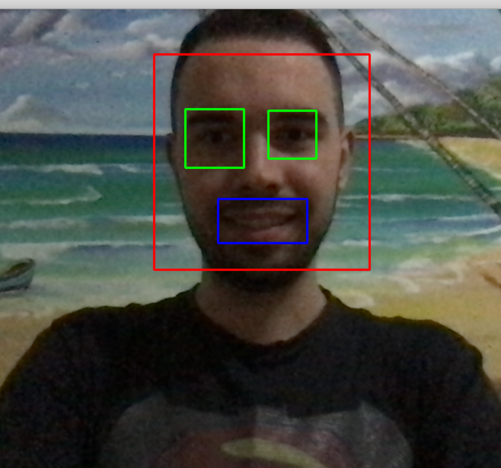
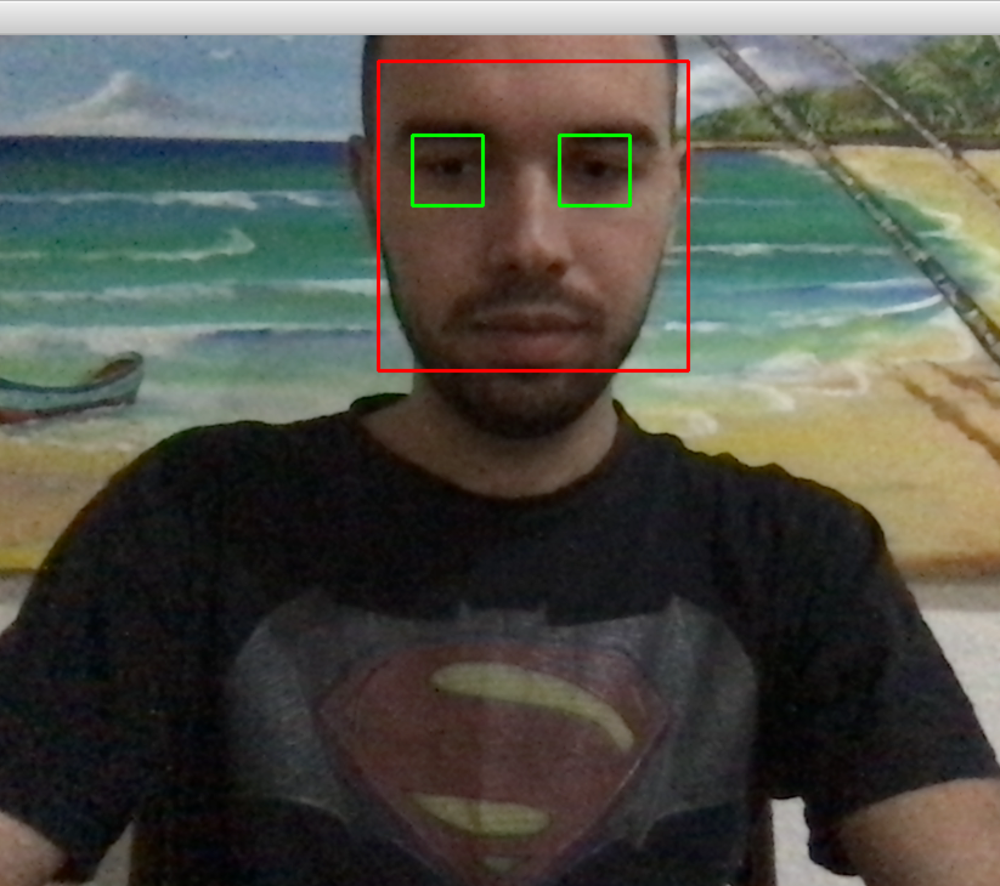

# Deep Learning and Computer Vision

The principle goal of this repository is to show some of my skill in computer vision and merge to Deep learning to instead much more powerful model based

#

  The next concept its using pytorch to combine <b>Deep Learning</b> and <b>Computer Vision</b>. The architecture using was Single Show Multibox Detector (SSD) to detect a human and dog the video <i>funny_dog.mp4</i>.

Bellow following the descriptio of the files used to make this project real:
<ul>
    <li> <b>data</b>: this folder contain based transform of going be compare input images;
    <li> <b>funny_dog.mp4</b>: will try to detect;
    <li> <b>layers</b>: this folder contain the multibox detection SSD;
    <li> <b>object-detection</b>: is hart of the model SSD;
    <li> <b>ssd.py</b>: contains the architecture multibox detection model.
</ul>
The Result of Object Detection Using <b>Single Shot Mutibox Detector (SSD)</b>:

#

 The Result of a Simple Application of Computer Vision to Detect Smile Emotion with <b>OpenCV</b>:

#

The Result of the <b>Face Detection</b> with <b>OpenCV:</b> 

# 

<b>Sincerely:</b> <a href="https://github.com/neemiasbsilva">Neemias B. Silva</a>
